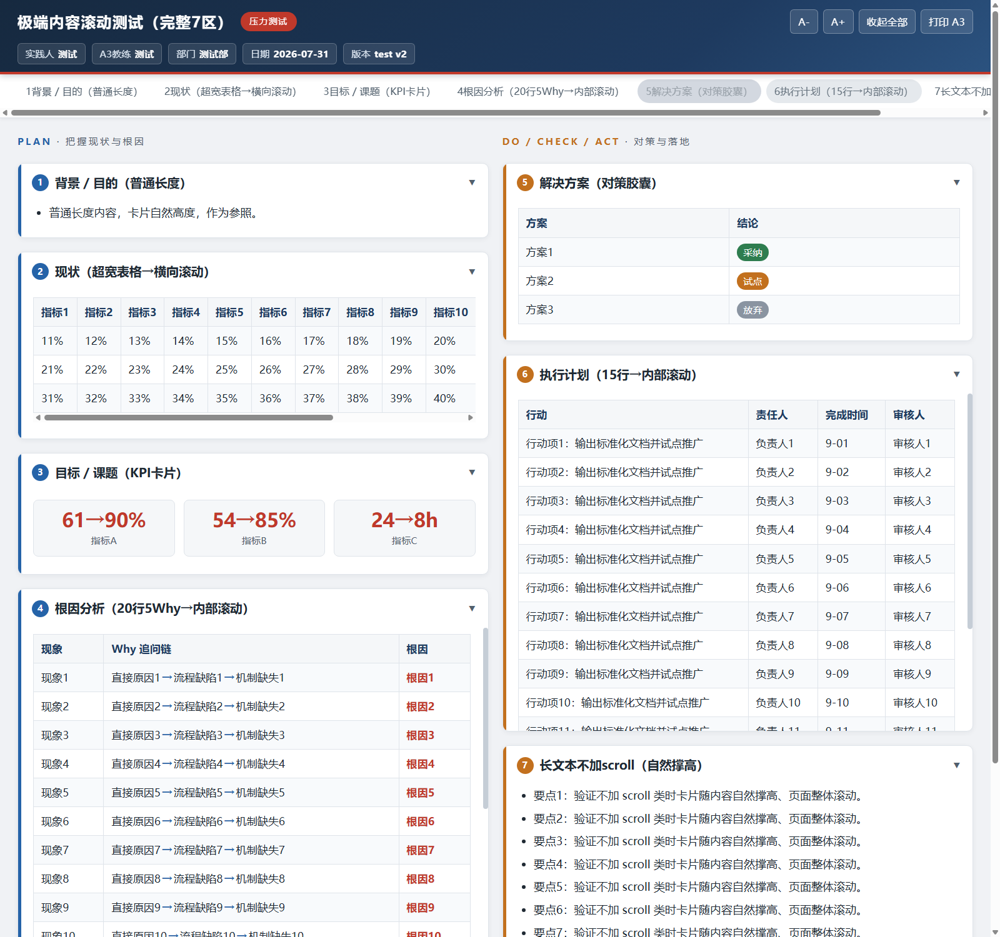

# a3-report

> 基于丰田 A3 方法论的 AI Agent 技能（Skill）：教练式引导 + 一页结构化报告生成

一套让 AI Agent 像 A3 教练一样工作的方法论技能包。它不替你思考——你提供数据和对问题的思考，AI 负责用提问引导分析路径（5Why 根因追问、OKR 目标、SMART 计划），并输出专业的一页 A3 报告（Markdown / 交互式 HTML / PPTX / Excel）。



## 特性

- **三种 A3 类型**：问题解决型（7 分区 + 5Why）、提案型、状态汇报型，自动判断类型
- **双模式**：信息充足直接生成；信息不足进入**教练模式**，按五步提问流程引导（理清问题 → 影响 → 目标 → 根因 → 行动）
- **5Why 追问协议**：逐层追问、复述确认、线索词拦截（"等待/不重视/沟通不畅"不是根因）、反向验证，杜绝 AI 代填 Why 链
- **OKR 目标结构**：1 个 O + 2-4 个 KR（当前值 → 目标值 + 期限），KR 即监控指标
- **SMART 计划校验**：每行行动必须有具体动作、交付物、责任人、期限、对应根因/KR
- **精益最佳实践**：叙事连贯（A3 讲故事不是填格子）、问题陈述=量化差距、根回（nemawashi）共识、活文档随 PDCA 升版本
- **四种输出格式**：Markdown（权威源）、交互式 HTML（屏幕阅读 + 打印自动切回单页 A3 横版）、PPTX（420×297mm 单页）、Excel（A3 纸型双栏）
- **行业无关**：纯方法论，不预设制造业或任何场景，适用于 IT/服务/运维/医疗/项目管理等

## 安装

将本仓库复制到 Agent CLI 的技能目录：

```bash
# 用户级安装
git clone https://github.com/mdsyw-chase/a3-report.git ~/.qoder/skills/a3-report

# 或项目级安装
git clone https://github.com/mdsyw-chase/a3-report.git .qoder/skills/a3-report
```

PPTX/Excel 输出需要 Python 依赖：

```bash
pip install python-pptx openpyxl
```

重启会话或执行 `/skills reload` 后生效。

## 使用

```
/a3-report <问题描述或报告主题>
```

示例：

```
/a3-report 客户投诉响应超时问题的根因分析
/a3-report 建设自动化测试平台的立项提案
/a3-report XX项目 Q3 阶段进展汇报
```

也可以自然语言触发：提到 "A3"、"5Why"、"根因分析"、"改善提案"、"PDCA" 等关键词时技能自动激活。

首次使用时，技能会先说明用法和角色分工，再进入三阶段对话：**确认问题**（背景 + 现状数据）→ **分析**（目标 → 5Why 根因 → 对策）→ **落地**（SMART 计划 → 跟踪），每阶段达成共识后继续。

### 角色分工（关键）

这是一套**方法论**，不替你思考。用好它的前提是理解分工：

| 你（用户）负责 | AI Agent 负责 |
|---|---|
| 提供真实数据、事实、现场信息 | 判断 A3 类型、组织报告结构 |
| 思考自己的问题、回答追问 | 像教练一样逐层追问（5Why），把关方法论质量 |
| 对目标、根因、对策做最终确认 | 把目标做成 OKR、把计划按 SMART 打磨、生成结果物 |

> 数据和答案在你那里。AI 不会编造数据——没有的信息会标 `[待确认]` 或继续追问。

### 让 AI Agent 使用本技能

**方式一：作为 Agent CLI 技能（推荐）**

安装到技能目录后（见上），Agent 会自动读取 `SKILL.md` 的 frontmatter，在你提到 A3/5Why/根因分析等场景时自动激活，并按 `SKILL.md` 的五步工作流执行、按需加载 `references/` 与调用 `scripts/`。

**方式二：任意支持自定义指令的 AI（无需 CLI）**

把 `SKILL.md` 的全文作为系统提示词 / 自定义指令粘贴给任意大模型（ChatGPT、Claude 等），再贴上 `references/a3-types.md` 和 `references/a3-coaching.md` 作为参考资料，即可让它按 A3 方法论工作。生成 PPTX/Excel 时，让它输出 `a3.json` 后本地运行 `scripts/a3_build.py`。

**方式三：程序化集成**

在你的应用 / Agent 框架中，把 `SKILL.md` 载入上下文作为角色设定，用户输入作为问题描述，即可复用整套 A3 引导逻辑。

### 高效使用建议

- **准备好数据再开始**：至少带一个量化现状值（当前率/耗时/成本/频次），追问会更快收敛
- **配合 5Why 追问**：AI 会连续问"为什么"，请基于事实回答，不要急着跳到对策
- **一次一阶段**：确认问题 → 分析 → 落地，每阶段达成共识再继续，避免返工
- **想直接出稿**：说"直接生成、别引导"，AI 会用你给的信息一次成稿并标注缺口
- **迭代升版**：A3 是活文档，对策执行后回来更新数据、升版本号（v1.0 → v1.1）

## 目录结构

```
a3-report/
├── SKILL.md                    # 技能入口：工作流程与质量标准
├── references/
│   ├── a3-types.md             # 三种 A3 类型分区结构、OKR/SMART 校验、质量清单
│   └── a3-coaching.md          # 教练模式：五步提问、5Why 追问协议、常见误区应对
├── assets/
│   └── a3-template.html        # 交互式 HTML 模板（屏幕阅读 + 单页 A3 打印）
├── scripts/
│   └── a3_build.py             # JSON → PPTX/Excel 生成脚本
└── docs/
    └── preview.png             # HTML 报告效果预览
```

## 方法论来源

- 丰田 A3 问题解决法与 PDCA
- John Shook《Managing to Learn》的 A3 教练对话模式
- 精益社区（LEI / Planet Lean）关于叙事性、差距陈述、根回共识的最佳实践
- OKR 与 SMART 原则

## License

[MIT](LICENSE)
